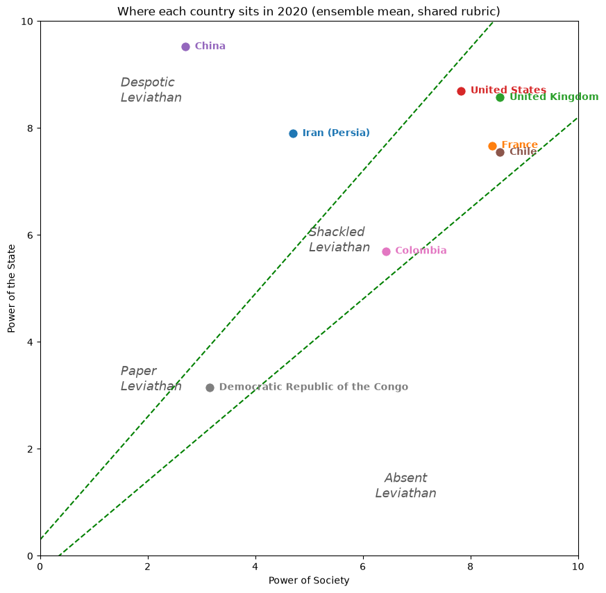
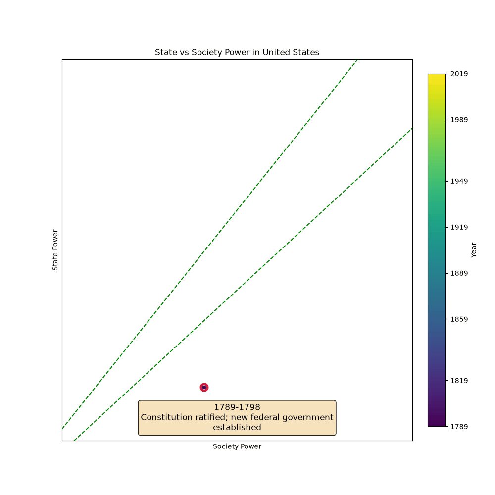

# Mapping the Narrow Corridor with Large Language Models

In *The Narrow Corridor: States, Societies, and the Fate of Liberty*, Daron Acemoglu and James A. Robinson [[1]](#1) — awarded the 2024 Nobel Prize in Economics in part for the body of institutional research this book belongs to — trace national histories as paths through a two-dimensional **(state power, society power)** space, with a narrow *corridor* between the two axes where liberty is sustained. But the book plots none: quantifying the two axes at each historical moment is the labor-intensive, judgment-laden task that has kept the framework qualitative. This project asks whether a **large language model (LLM)** can operationalize it. It scores a country period by period, using chain-of-thought [[3]](#3) (events first, then a score) and in-context anchoring [[4]](#4) on prior periods against an explicit 0–10 rubric, returning schema-validated scores, to produce reproducible trajectories that can be checked against an expert index (V-Dem).

📄 **[Read the paper](./paper/main.pdf)** · 🌐 **[Interactive gallery](https://esonghori.github.io/narrow-corridor-llm/)**


## The atlas

The short paper ([`paper/main.pdf`](./paper/main.pdf); reproduce it end to end via [`paper/RUNBOOK.md`](./paper/RUNBOOK.md)) builds an **eight-country trajectory atlas** — Iran, France, the United Kingdom, the United States, China, Chile, Colombia, and the Democratic Republic of the Congo — chosen so at least one country falls in each of the book's four **Leviathan types**: Despotic (China, Iran), Shackled (UK, France, US), Paper (Colombia), and Absent (DR Congo). It compares four LLMs (Gemini, Claude, GPT, and an open-weight Qwen), checks the scores against the **V-Dem** expert index, and quantifies inter-model agreement. Because every country is scored against the same fixed rubric, all eight sit on one shared map of the book's regions:



## Install

Uses [uv](https://docs.astral.sh/uv/) — a normal Python package, no Colab or Drive.

```bash
uv sync
cp .env.example .env   # add a key for whichever provider(s) you want
```

## Usage

Provider-agnostic via [LiteLLM](https://docs.litellm.ai/): swap models by changing the model string (`uv run ncorridor models` lists suggestions and shows which API keys are set). Each period costs one or two LLM calls; responses are cached under `runs/.cache/`, so re-runs and plot/animation iteration are free.

```bash
uv run ncorridor generate --country "Iran (Persia)" --start 1880 --end 2020 --step 10 \
  --model anthropic/claude-opus-4-8 --out runs/iran.json
uv run ncorridor plot    runs/iran.json --out runs/iran.png
uv run ncorridor animate runs/iran.json --out runs/iran.gif   # reveals each period's key event
```

Or from Python:

```python
from narrow_corridor import get_narrow_corridor, save_path
from narrow_corridor.plot import plot_path
from narrow_corridor.animate import animate_path

path = get_narrow_corridor(model="anthropic/claude-opus-4-8", country="France",
                           start_year=1789, end_year=2020, step_years=10)
save_path(path, "runs/france.json"); plot_path(path, "runs/france.png"); animate_path(path, "runs/france.gif")
```

## Interactive gallery

`scripts/build_site.py` turns a runs directory into a self-contained GitHub-Pages gallery of plots with click-to-play animations:

```bash
uv run python scripts/build_site.py --runs paper/experiments/results --out docs
```

Browse the hosted version at <https://esonghori.github.io/narrow-corridor-llm/>. Every run in the paper (8 countries × 4 models, plus the V-Dem and ensemble atlases) lives under [`paper/experiments/results/`](./paper/experiments/results), each with its full prompt/response transcript. One trajectory, animated (the United States, ensemble mean):



## Cite

```bibtex
@misc{MappingNarrowCorridor2026,
  title        = {Mapping the Narrow Corridor with Large Language Models},
  author       = {Songhori, Ebrahim M.},
  year         = {2026},
  howpublished = {\url{https://github.com/esonghori/narrow-corridor-llm}}
}
```

## References
- <a id="1">[1]</a> Acemoglu, Daron, and James A. Robinson. *The Narrow Corridor: States, Societies, and the Fate of Liberty*. Penguin Press, 2019.
- <a id="3">[3]</a> Wei, Jason, et al. "Chain-of-thought prompting elicits reasoning in large language models." *NeurIPS* 35 (2022): 24824–24837.
- <a id="4">[4]</a> Brown, Tom, et al. "Language models are few-shot learners." *NeurIPS* 33 (2020): 1877–1901.
