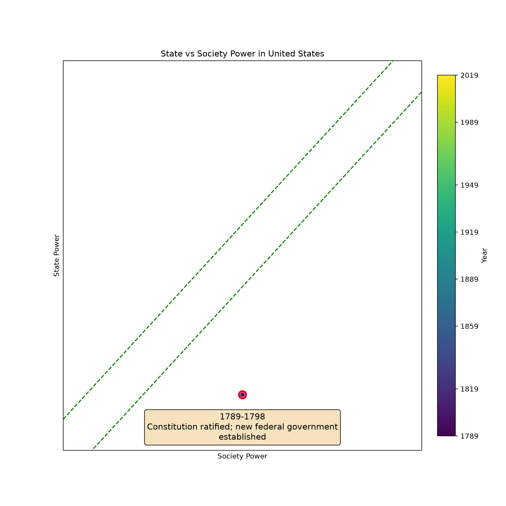
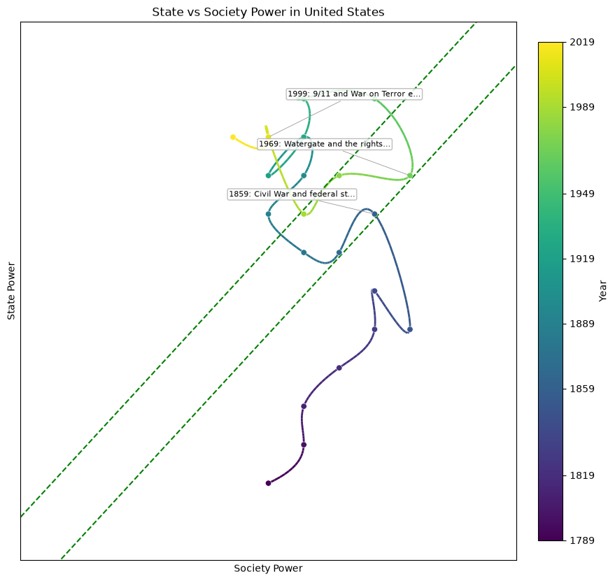

# Visualize Narrow Corridor using Generative Artificial Intelligence (AI).

In **The Narrow Corridor: States, Societies, and the Fate of Liberty, Daron Acemoglu and James A. Robinson** [[1]](#1) propose a framework for analyzing a country's historical trajectory within a two-dimensional space defined by the relative power of the state and society. While the book lays out this conceptual model, it does not include any concrete visualization example.

A major challenge in visualizing such dynamics lies in the difficulty of assigning quantitative values to the state and society's power at different historical moments. Historians and scholars in the humanities are well aware of the inherent biases, subjective interpretations, and the complexity involved in reducing nuanced power dynamics to numerical values.

This project addresses that challenge by employing a **Large Language Model (LLM)** [[4]](#4) to generate visualizations of historical trajectories. Our approach involves prompting the LLM to identify significant historical events and trends for a specific country in a historical period, and then using that information to assign numerical values for state and society power, allowing us to visualize the country's path in the spirit of the Narrow Corridor framework.

We acknowledge the risks of bias in LLMs, especially those inherited from their training data. However, we argue that, with careful prompt engineering and systematic methodology, LLMs can offer a more scalable and potentially less biased alternative to purely expert-driven approaches.

# Methodology

To improve the accuracy and relevance of the numerical values for state and society power, we apply the Chain-of-Thought technique [[3]](#3). For each historical period (e.g., a 5-year span), the LLM is first asked to identify major events and trends. This contextual narrative is then included in the next prompt, which asks the model to assign quantitative values for state and society power during that period.

To ensure consistency across time periods, we also use In-Context Learning [[4]](#4). Beginning from the earliest year, we provide the model with prior period values when predicting the next, thereby anchoring its output and improving temporal coherence.

To make scores comparable across countries and across models, each scoring prompt embeds an explicit **0–10 rubric** for both axes and neutrality guidance (weigh evidence both ways, avoid presentism, treat the two axes as independent). The model returns a structured JSON object per period (the two power values, their per-period changes, a one-line key event, and a short justification), validated against a schema rather than scraped from free text.

# Install

This project uses [uv](https://docs.astral.sh/uv/). It is a normal Python package — no Colab or Google Drive required.

```bash
uv sync
cp .env.example .env   # then add a key for whichever provider(s) you want
```

# How to Use

Any model reachable through [LiteLLM](https://docs.litellm.ai/) works — swap providers by changing the model string. List the suggested strings and see which API keys are set:

```bash
uv run ncorridor models
```

1. **Generate** a trajectory (one or two LLM calls per period; responses are cached under `runs/.cache/`):

   ```bash
   uv run ncorridor generate \
     --country "Iran (Persia)" --start 1880 --end 2025 --step 5 \
     --model gemini/gemini-3.5-flash \
     --out runs/iran.json
   ```

   Swap `--model anthropic/claude-opus-4-8`, `--model openai/gpt-4o`, `--model openrouter/qwen/qwen-2.5-72b-instruct`, etc. to compare models.

2. **Plot** the static trajectory in state–society power space:

   ```bash
   uv run ncorridor plot runs/iran.json --out runs/iran.png
   ```

3. **Animate** the trajectory as a GIF, showing each period's key historical event and the move it caused:

   ```bash
   uv run ncorridor animate runs/iran.json --out runs/iran.gif
   ```

The library is also importable:

```python
from narrow_corridor import get_narrow_corridor, save_path, load_path
from narrow_corridor.plot import plot_path
from narrow_corridor.animate import animate_path

path = get_narrow_corridor(model="anthropic/claude-opus-4-8", country="France",
                           start_year=1780, end_year=2025, step_years=5)
save_path(path, "runs/france.json")
plot_path(path, "runs/france.png")
animate_path(path, "runs/france.gif")
```

# Website (interactive gallery)

`scripts/build_site.py` turns a runs directory into a static gallery — PNG plots with click-to-play animations — for GitHub Pages:

```bash
uv run python scripts/build_site.py --runs runs --out docs
# or, for the paper's sweep:
uv run python scripts/build_site.py --runs paper/experiments/runs --out docs
```

It reads each run's JSON sidecar for the country/model names, copies the images into `docs/assets/`, and writes a self-contained `docs/index.html` (model filter + click-to-animate; GIFs load on demand). Preview locally with `python -m http.server -d docs`, then open <http://localhost:8000>. To publish, enable **GitHub Pages → Deploy from branch → `main` / `docs`** in the repo settings. (Because Pages serves committed files, `docs/assets/` holds the images — GIFs are a few MB each.)

# Example

As an example, the paper's reference-model run traces the United States' path from 1789 in decade-length periods, by Claude Opus 4.8. You can find the full prompt/response transcript [here](./paper/experiments/results/united-states__anthropic-claude-opus-4-8.json).

.
.

The full sweep (6 countries × 4 models, plus V-Dem and ensemble atlases) lives under [`paper/experiments/results/`](./paper/experiments/results); browse it interactively in the [gallery](./docs).

# How to cite

If you use this code, please cite this:

```
@misc{VisualizeNarrowCorridor2025,
  title = {Visualize Narrow Corridor using Generative Artificial Intelligence.},
  author = {M. Songhori, Ebrahim},
  howpublished = {\url{https://github.com/esonghori/visualize_narrow_corridor_with_ai}},
  url = "https://github.com/esonghori/visualize_narrow_corridor_with_ai",
  year = 2025,
  note = "[Online; accessed 25-May-2025]"
}
```

# Refrences
- <a id="1">[1]</a> Acemoglu, Daron, and James A. Robinson. The Narrow Corridor: States, Societies, and the Fate of Liberty. Penguin Books, 2019. 
- <a id="2">[2]</a> Kaplan, Jared, Sam McCandlish, Tom Henighan, Tom B. Brown, Benjamin Chess, Rewon Child, Scott Gray, Alec Radford, Jeffrey Wu, and Dario Amodei. "Scaling laws for neural language models." arXiv preprint arXiv:2001.08361 (2020).
- <a id="3">[3]</a> Wei, Jason, Xuezhi Wang, Dale Schuurmans, Maarten Bosma, Fei Xia, Ed Chi, Quoc V. Le, and Denny Zhou. "Chain-of-thought prompting elicits reasoning in large language models." Advances in neural information processing systems 35 (2022): 24824-24837.
- <a id="4">[4]</a> Brown, Tom, Benjamin Mann, Nick Ryder, Melanie Subbiah, Jared D. Kaplan, Prafulla Dhariwal, Arvind Neelakantan et al. "Language models are few-shot learners." Advances in neural information processing systems 33 (2020): 1877-1901.
